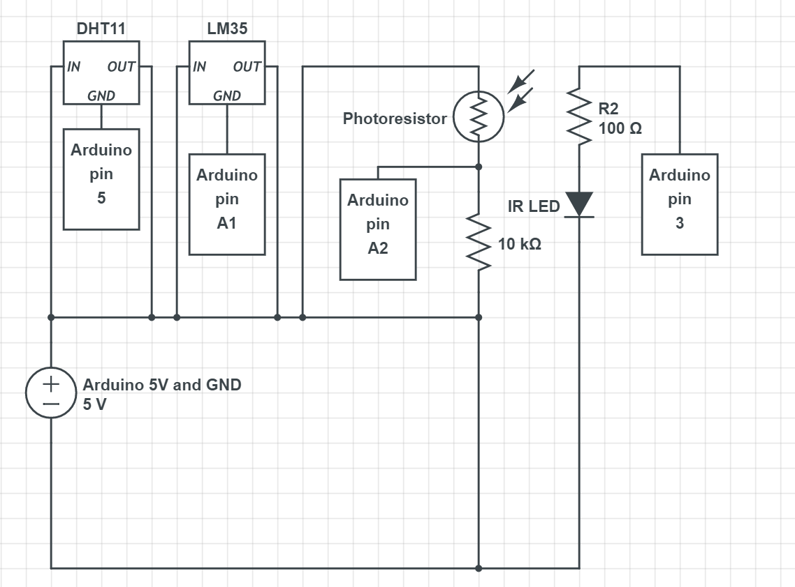
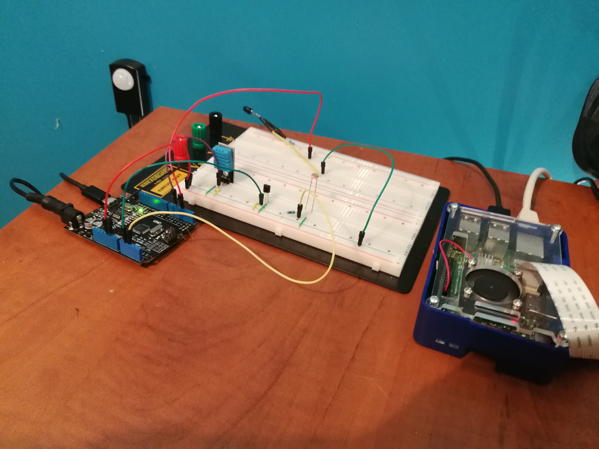
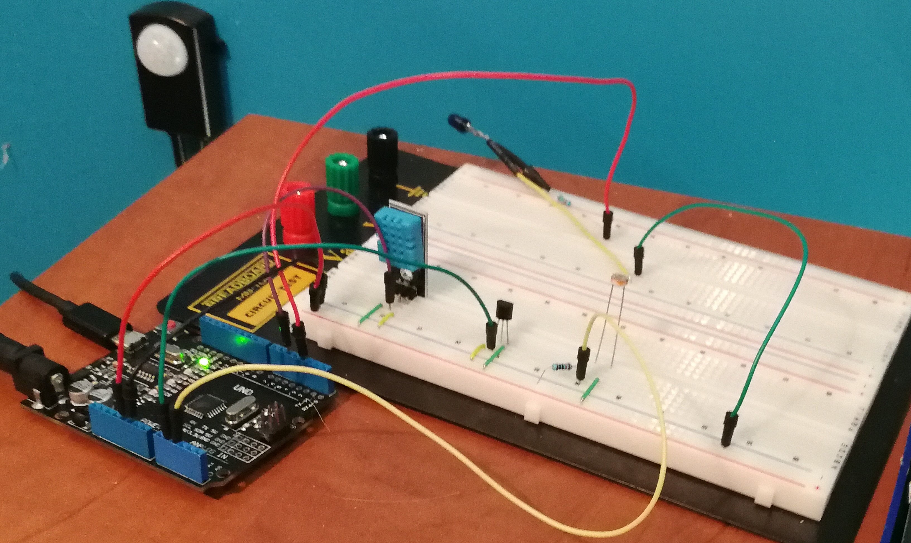

# Hardware

List of hardware
* Arduino UNO
* Raspberry PI 3 with 32GB Micro SD card
* 9 Amp power supply for Arduino (optional)
* 2.5 Amp power supply for Raspberry PI
* Ethernet cable (optional)
* Cooling fan for Raspberry PI (Optional)
* Male-Male Jumper cables
* Breadboard
* IR Led
* 10k Ohm resistance
* 220 Ohm resistance
* LM35 temperature sensor
* Photoresistance
* DHT11 Temperature/Humidity sensor
* Micro USB -> USB cable

## Circuit

Poorly drawn circuit diagram

View of circuit on breadboard

Close up

Left to right:

* Arduino
* Light IR receiver (on the wall)
* Breadboard
    * DHT11 Temperature/Humidity sensor
    * LM35 temperature sensor
    * Photoresistance