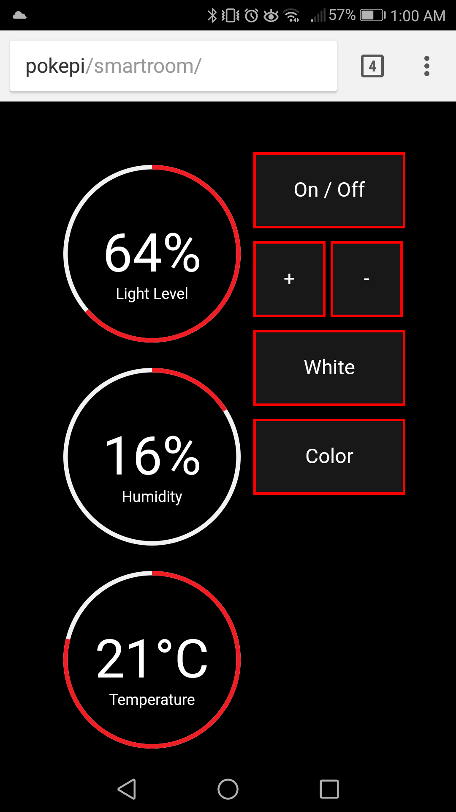
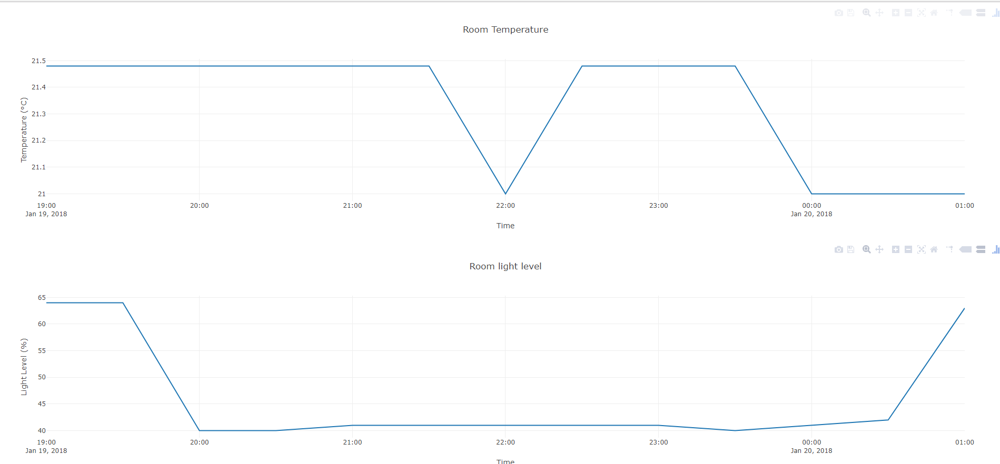

# Web interface

Currently there are two web interfaces, the main smartroom dashboard page and the historical data page.

## Dashboard

This page lets your interface with the lights and gives you reading from the sensors directly

## Historical data

This page lets your browse historical data on the light and temperature

